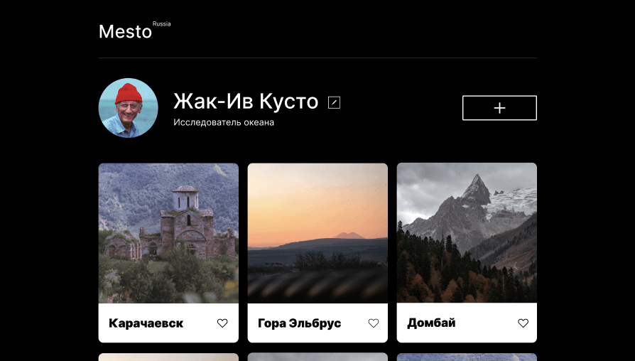

# Проект: Место

     

Данный проект представляет собой Веб-страницу с информацией о природных объектах на территории России, которые можно порекомендовать для посещения в качестве туриста. На данный момент посетитель может редактировать информацию об авторе публикации.
Основная цель данного проекта - используя готовый шаблон из Figma, спроектировать адаптивную веб-страницу для разрешений экрана от 320рх до 1280рх, а также используя язык программирования JavaScript добавить функционал по редактированию контента страницы.
На данный момент реализованы такие функции, как:

- открытие и закрытие popup окна редактирования профиля автора
- сохранение информации об авторе после нажатия кнопки Сохранить в форме

## В проекте использованы  технологии:

- HTML
- CSS
- JavaScript
- BEM
- Figma

## Инструкция по установке:
1. Клонировать репозиторий
`git clone https://github.com/DmitryKazancev/mesto`
2. Установить зависимости
`npm i`
3. Запустить проект локально
`npm run dev`

## 🔗 Ссылка на проект:
[Проект: Место](https://dmitrykazancev.github.io/mesto/)

## 🚀 Обо мне
Студент Яндекс Практикума.

